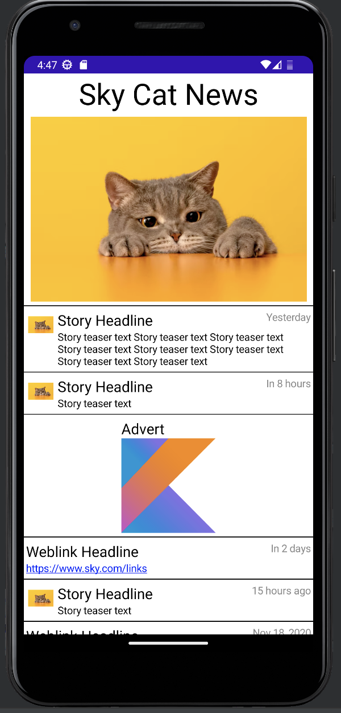

# Build App

1. Using Android Studio (Latest Version)
2. Select yes for building gradle if popup appears
3. Click the play button on the top tool bar
   1. This should build the app and run it in a virtual device

# Notes - Process Of Making + Decision Making

1. Initial used xml files to render screens, decided to restart using jetpack compose for the more modern approach (significantly less boiler plate too)

2. Read data in using json file reader, then parse to data classes declared in `models`
   1. Particularly happy about how the sealed classes parsed and using `when` statements to handle the polymorphic types in an exhaustive type check fashion

3. I didn't focus on the UI much, I added some placeholders and basic navigation - you can navigate back with the UI back button
   1. Added clickable stories, links, asset image loading, url image loading, and scrolling

4. The Json file reader can be swapped out easily for an API call, you would just need to implement a fetcher in the Repository class

5. Testing - I've laid out many scenario's for testing in the testing folder
    1. But I've left out the implementation, mainly due to time, and that I've had some issues with the mocking functionality for Kotlin/Android

6. To inspect the code, I suggest stepping through from the MainActivity as you can find everything from there
   
